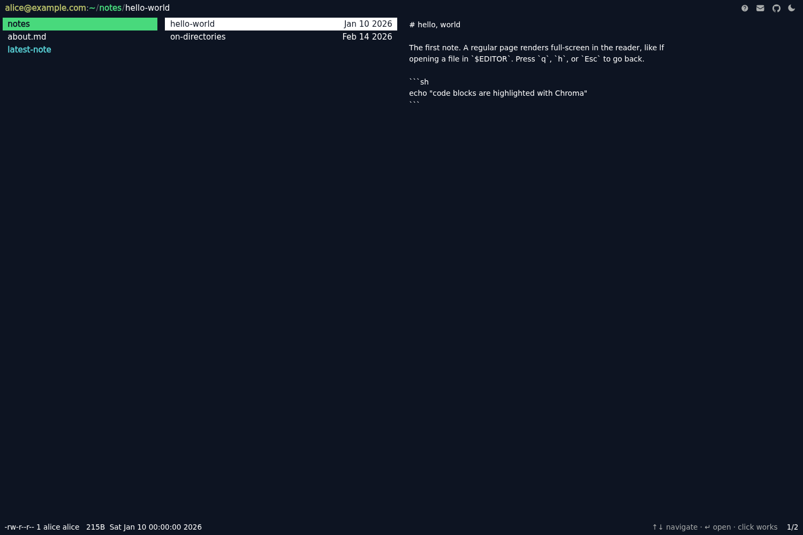

# lfish — a Hugo theme

Your website, rendered as the [lf](https://github.com/gokcehan/lf) terminal file
manager. Three miller columns (parent · current · preview), a moving cursor,
live previews, and vi-style keybindings — all over plain Hugo content.



Live demo: [dylanc.com](https://dylanc.com/)

```
dylan@dylanc.com   dylan/posts/hello-world
 projects/    > hello-world        # hello, world
 posts/         on-miller-colu…    welcome to my homedir…
 about.md
 links.md
 -rw-r--r-- 1 dylan dylan 76B Jun 20 2026                 1/2
```

## The idea

The content tree *is* a filesystem:

- the home page and every section are **directories**
- every regular page is a **file**
- being on a directory list page means you're "inside" it with one entry
  selected — the same state lf uses, which makes navigation seamless

Every entry is a real `<a href>`, so the site works with JavaScript disabled.
JS only adds the cursor, live preview swapping, the keybindings, the theme
toggle, and the `zh` hidden-files toggle.

Opening a file (`l` / click) leaves the manager for a **full-screen reader** —
like lf opening the file in `$EDITOR`. The preview shows the *raw markdown
source*; the reader shows the *rendered* document.

## Keybindings

### Manager

| key | action |
|-----|--------|
| `j` / `↓`, `k` / `↑` | move down / up |
| `l` / `→` / `enter` / click | open the selected entry |
| `h` / `←` | go up (restores the cursor onto the folder you came from) |
| `gg` / `G` | jump to top / bottom |
| `gh` | go home (`~`) |
| `space` | mark the entry, move down |
| `/`, `n` / `N` | incremental search, next / prev match |
| `zh` | show / hide hidden files (persisted) |
| `zn` `zs` `zt` `za` | info column: none / size / time / both |
| `sn` `ss` `st` `se`, `zr` | sort by name / size / time / ext, reverse |
| `T` | toggle light / dark (persisted) |
| `?` | toggle the keybinding cheatsheet |

### Reader

| key | action |
|-----|--------|
| `j` / `k`, `d` / `u`, `space` | scroll line / half-page / page |
| `gg` / `G` | top / bottom |
| `:q` (also `:wq`/`:x`), `ZZ`, `q`, `esc`, `h` | close, back to the manager |
| `T` | toggle theme |

### Photo viewer

A page with `imgname` in its front matter renders as an sxiv-style photo view.

| key | action |
|-----|--------|
| `j` / `k` | next / previous photo in the album (loops) |
| `o` | toggle the album thumbnail grid (`hjkl`/arrows pick, `enter`/click opens) |
| `i` | toggle the full info box |
| `h` / `esc` / `q` | back to the album directory |

## Content

Standard Hugo. Sections become directories, pages become files. Front-matter
conventions:

```yaml
title:  "hello-world"   # shown as the file name
date:   2026-06-20      # the lf `info` date column + status-bar mtime
hidden: true            # excluded from listings until `zh` reveals them
nolist: true            # excluded from listings entirely (no zh)
link:   "/some/page/"   # render as a symlink -> that page
latest: "/posts"        # symlink -> the newest page under that section
perms:  "drwxrwxrwt"    # override the ls -l permission string
owner:  "root"          # override the ls -l owner (group follows)
denied: "/root"         # opening it shows "permission denied"
bytes:  1337            # override the reported file size
imgname: "sunset"       # photo page: sibling image resource -> photo view
caption / location / camera / lens   # photo info-box fields
```

Ordering follows lf's default (`dirfirst` + natural name sort, leading `.`
first): dot-dirs, dirs, dot-files, files. Hugo ignores on-disk names starting
with `.`, so to make a dot-folder name it `config/` on disk and set
`title: ".config"`.

A directory can set its own default order in its `_index.md`, using lf's
option names — the classic case is a blog section that wants newest first:

```yaml
sortby:  time   # name (default) | time
reverse: true   # descending
```

Other directories are unaffected. When a visitor picks a sort explicitly
(menu or `s` keys) that choice applies everywhere for the session, riding
over any per-directory defaults — exactly like lf's session-global `sortby`.

## Configuration

```toml
theme = "lfish"

[params]
  user = "dylan"            # left of the prompt: user@host, and the home label
  host = "dylanc.com"       # right of the prompt
  group = "dylan"           # ls -l group in the status bar (defaults to user)
  info_format = "Jan _2 2006"  # Go date layout for the info date column
  description = "…"         # fallback <meta description>
  email  = "me@dylanc.com"  # top-bar mail icon (omit to hide)
  github = "https://github.com/…"  # top-bar github icon (omit to hide)
  launched = "2026-06-01"   # site launch; uptime in the fetch shortcode

  [params.lf]
    root = "/fs"       # content path of the absolute-filesystem tree
    home = "/fs/home"  # content path of its /home directory (~'s parent)
    rootfs = true      # false: no Unix layer — ~ is the top, `h` stops there
```

### The Unix tree

`~` (the site home) can sit inside a larger absolute filesystem — `h` from home
lands in `/home`, and you can walk up to `/`. That tree is ordinary content:
a section marked `fsroot: true` + `unix: true` (with `cascade: unix: true`),
conventionally at `content/fs/` with `url:` front matter mapping each directory
to its absolute path (`/etc/`, `/tmp/`, …). `params.lf.root`/`params.lf.home`
tell the theme where the tree lives if you name it something else.

Don't want it? Set `rootfs = false` (or simply don't author the tree) and the
home directory is the highest directory. See `exampleSite/` for a working tree
under a non-default name.

Code highlighting is class-based — the theme ships its own Chroma palette in
`lf.css` (onedark for dark, the Tomorrow palette for light, so code follows
the `T` toggle). Just turn classes on:

```toml
[markup.highlight]
  noClasses = false
```

## Theming

Two palettes — Tomorrow Night (dark, Ghostty's default) and Tomorrow (light) —
defined as CSS custom properties at the top of `assets/css/lf.css`. Override
`--dir`, `--accent`, `--bg0`, etc. to retheme. The light/dark choice is toggled
with `T` or the top-bar button, saved to `localStorage`, and applied before
first paint (no flash).

## Files

```
layouts/
  _default/baseof.html     frame + asset pipeline
  _default/list.html       home/sections/taxonomies → miller.html
  _default/single.html     a page → reader.html (or photo.html)
  _markup/render-link.html markdown links, target=_blank for external
  404.html                 "no such file or directory"
  partials/
    miller.html            the three-pane manager (the core)
    entries.html           a directory's listing (dot-dirs, dirs, dot-files, files)
    preview.html           column 3: dir listing, or a file's raw markdown
    reader.html            full-screen rendered-markdown view
    photo.html             sxiv-style photo page (album grid, info box)
    infocol.html           the per-entry size/date info column
    stat-line.html         the ls -l status-bar line
    edate.html, mtime.html effective date of an entry / its mtime string
    size.html, size-bytes.html  human size / byte count of an entry
    name.html, ftype.html  display name / file-type class of an entry
    crumbs.html            breadcrumb chain for the path bar
    target.html, linkhref.html  symlink resolution (link:/latest:)
    controls.html          top-bar icons (email, github, rss, theme)
    head.html, helpsheet.html
  shortcodes/
    fetch.html, fetchlogo.html  fastfetch-style system-info block
assets/
  css/lf.css               one stylesheet
  js/lf.js                 one vanilla-JS engine (manager + reader + photo)
```

## Static files

`head.html` links a few assets the *site* provides in its own `static/`:
`favicon.svg`, `favicon.png`, `icon-192.png` (apple-touch-icon), and
`manifest.webmanifest`. The manifest should declare two icon sets: opaque
full-bleed `purpose: maskable` icons (Android crops them to a circle) and
transparent `purpose: any` icons (desktop installs show them as-is). `lf.js`
also registers `/sw.js` as a service worker if present — its absence is
handled, so everything here is optional but recommended.

No build step, no runtime dependencies. Requires Hugo extended ≥ 0.146.

## Example site

`exampleSite/` is a tiny standalone site exercising the theme — a homedir,
a notes section, `link:`/`latest:` symlinks, a hidden file, and a Unix tree
under a non-default content path. Run it with:

```sh
cd themes/lfish/exampleSite
hugo server --themesDir ../..
```
